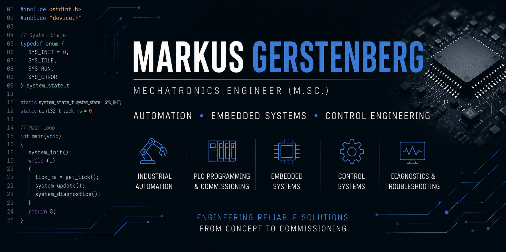

  

  👋 Hi! I'm Markus — a Mechatronics Engineer (M.Sc.) focused on industrial automation, embedded systems and marine technology.
    
  My background combines PLC programming, commissioning and troubleshooting of complex electrical systems in safety-critical environments with practical offshore sailing and onboard systems experience.
    
  I enjoy building reliable technical systems — from industrial automation and embedded control solutions to marine electrification and onboard energy systems.
    
  Currently interested in automation, embedded engineering, sustainable propulsion technologies and offshore systems.

###

## Engineering Toolbox
### Industrial Automation / Control

 Beckhoff TwinCAT 3 · IEC 61131-3 · PLC Systems · Commissioning · Control Engineering

### Embedded Systems

  Embedded C · C/C++ · Python · Linux · ARM

### Communication

  CAN Bus · Modbus · I2C · UART · SPI · MQTT · TCP/IP · Serial Communication

 

### Tools

  Git · Eclipse · Wireshark · Oscilloscope · Logic Analyzer

 

### Electrical & System Engineering

  Electrical Troubleshooting · Distributed Systems · Diagnostics · System Integration · Technical Documentation

 
##  GitHub Stats

  
  

###

##  Contact

  

### 

